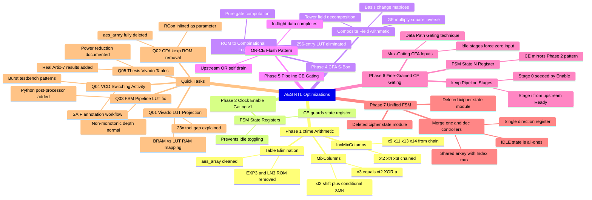

# AES RTL Optimization Documentation

**Project:** Hardware AES (128/192/256-bit) — Artix-7 xc7a35t FPGA  
**Scope:** All optimization phases (v1.0 + v2.0) and supporting quick tasks  
**Target:** Theory-first documentation; code cited as evidence, not as subject

---

## Mindmap



---

## Background and Goals

AES (FIPS-197) defines a fixed-size block cipher operating on a 4×4 byte state matrix over 10/12/14 rounds depending on key length. The goal of this project is not to change *what AES computes*, but to change *how efficiently the RTL implements that computation* — reducing LUT area, flip-flop toggle activity, and consequently dynamic power on an FPGA, without ever altering the cryptographic semantics.

Two architectural variants exist throughout:

| Architecture | Description | Trade-off |
|---|---|---|
| **FSM** | Single datapath, reused each round via state machine | Small area, lower throughput |
| **Pipeline** | Nr−1 staged datapaths, one per round | High throughput, large area |

All seven optimization phases operate on both variants unless noted. The correctness criterion throughout is a full ENCRYPT→DECRYPT round-trip for all three key sizes.

---

## Phase 1 — xtime Arithmetic and Table Elimination

### What Changed

The original implementation computed GF(2⁸) multiplication using pre-computed lookup tables: `EXP3[]` and `LN3[]` (the antilog and log tables for the generator α=3 in GF(2⁸)). These were stored in `aes_array.sv` and accessed via parameterized ports on every module that performed multiplication.

Phase 1 replaced all GF(2⁸) multiplications in `MixColumns` and `InvMixColumns` with direct **xtime** combinational arithmetic, then atomically removed the EXP3/LN3 tables and their port stubs across all 10 modules.

### Theory: Why xtime Works

In GF(2⁸) with reduction polynomial p(x) = x⁸ + x⁴ + x³ + x + 1 (hex 0x11B), multiplication by 2 (the field element x) has a closed-form bitwise rule:

```
xtime(a) = (a << 1) XOR (0x1B  if  a[7] = 1  else  0x00)
```

This is because shifting left by 1 computes a·x, and if the degree-8 term is produced (a[7]=1), we reduce modulo p(x) by XOR-ing with 0x1B = x⁴+x³+x+1 (the lower 8 bits of p(x)).

Every coefficient in the MixColumns matrix {1, 2, 3} is expressible in terms of xtime:

| Coeff | Expression |
|---|---|
| ×1 | a (identity) |
| ×2 | xtime(a) |
| ×3 | xtime(a) XOR a |

For InvMixColumns, the coefficients {9, 11, 13, 14} require chained applications:

| Coeff | Derivation |
|---|---|
| ×2 | xt2(a) |
| ×4 | xt2(xt2(a)) = xt4(a) |
| ×8 | xt2(xt4(a)) = xt8(a) |
| ×9 | xt8 XOR a |
| ×11 | xt8 XOR xt2 XOR a |
| ×13 | xt8 XOR xt4 XOR a |
| ×14 | xt8 XOR xt4 XOR xt2 |

None of these derivations alter the mathematical result — they are merely more efficient *computations* of the same field multiplications. The table-based approach computes `gmul(a, c) = EXP3[(LN3[a] + LN3[c]) mod 255]`, which is provably equivalent but requires ROM reads.

### Why Semantics Are Preserved

The MixColumns transformation is defined as a matrix multiply over GF(2⁸):

```
[b0]   [2 3 1 1] [a0]
[b1] = [1 2 3 1] [a1]  (mod p(x))
[b2]   [1 1 2 3] [a2]
[b3]   [3 1 1 2] [a3]
```

xtime is a provably correct implementation of ×2 in GF(2⁸) with this specific reduction polynomial. Deriving ×3, ×9, etc. from xtime is elementary field algebra — no approximation, no truncation. The output is bit-for-bit identical to the table lookup. The only difference is the *computational path*, not the *mathematical value*.

### Impact

| Metric | Before | After |
|---|---|---|
| EXP3/LN3 ROM | 512 × 8-bit entries | Eliminated |
| Port stubs | 10 modules with EXP3/LN3 ports | Fully removed |
| Combinational logic | ROM read + address compute | Shift + conditional XOR |

On FPGA, ROM reads map to distributed LUT RAM or BRAM. Pure combinational XOR/shift logic maps to fewer, faster LUTs, contributing to the area reductions seen in later Vivado synthesis.

---

## Phase 2 — Clock Enable Gating v1 (FSM State Registers)

### What Changed

Three FSM modules (`aes_cipher_state.sv`, `aes_icipher_state.sv`, `aes_kexp_state.sv`) had their state registers wrapped with clock enable conditions. Every `always_ff` block that previously updated on every clock edge now only updates when:

```
CE = (r.state != IDLE) OR (r.ready == 1) OR (Enable == 1)
```

### Theory: Data Path Gating vs Clock Gating

This is the central conceptual distinction of this project. **It is essential to understand that what is implemented here is NOT clock gating in the hardware sense.**

**Clock Gating** (as done by synthesis tools like Vivado/Design Compiler) works by inserting a gated clock cell (ICG — integrated clock gate) upstream of a register's clock input. The clock signal itself is suppressed; the register receives no clock edge and therefore draws zero dynamic power:

```
P_dynamic = α · C · V² · f

When ICG suppresses f: P_dynamic → 0 for those registers
```

Here α is the switching activity factor, C the capacitance, V the supply voltage, and f the clock frequency.

**Data Path Gating** (what this project implements) works differently. The clock always arrives at the register. Instead, the *enable* input of the register's flip-flop is gated:

```systemverilog
always_ff @(posedge clk) begin
  if (CE) begin
    r <= next_r;    // only loads new data when CE is asserted
  end
  // else: r retains its value — but the clock edge still fires!
end
```

In FPGA technology, a flip-flop with a clock enable (CE pin) is synthesized as a single primitive (e.g., Xilinx FDRE). The clock still toggles every cycle, but **the data input is muxed**: when CE=0, the flip-flop feedback path is selected instead of the D input, so Q does not change. This means:

- The clock net still switches (same clock tree power)
- The flip-flop cell still sees the clock edge (same FF power)
- **The data fanin cone does NOT toggle** (reduced toggle activity on state wires and downstream combinational logic)

The reduction in dynamic power comes from **switching activity (α)** dropping for the *data* signals, not from suppressing clock edges. This is why this technique is called **Data Path Gating** in this documentation.

### Why the CE Condition Has Three Terms

```
CE = (r.state != IDLE) OR (r.ready == 1) OR (Enable == 1)
```

- `r.state != IDLE`: Any non-idle state must always be able to advance. Removing this would stall mid-computation.
- `r.ready == 1`: The ready flag must persist after the final computation round completes, so the output can be read. Without this term, ready would immediately freeze and the host would never see the done signal.
- `Enable == 1`: A fresh encryption/decryption request arrives via Enable. This seeds the FSM out of IDLE.

All three terms are logically necessary. Removing any one breaks correct behavior in a specific corner case.

### Impact

Registers that were toggling on every clock cycle (even when the AES engine is idle) now hold their value. The combinational logic feeding those registers also stops toggling, cascading power savings through the fanout cone. This does not reduce LUT count (the same logic exists), but reduces α·C·V²·f dynamic power.

---

## Phase 4 — CFA S-Box (Composite Field Arithmetic)

### What Changed

The AES S-Box (`SubBytes` transformation) was previously implemented as a 256×8-bit lookup table (ROM). Phase 4 replaced this with a fully combinational implementation based on Canright's 2005 composite-field inversion technique, operating in GF((2⁴)²).

Additionally, Phase 4 eliminated the ROM-based `SBox[]` and `IBox[]` port stubs that carried lookup table access through the module hierarchy (mirroring what Phase 1 did for EXP3/LN3).

### Theory: Why the S-Box Is a Field Inversion

The AES S-Box is defined as:

```
S(a) = AffineTransform( a^(-1) in GF(2^8) )   if a ≠ 0
S(0) = AffineTransform(0) = 0x63
```

where the affine transform is a fixed 8×8 GF(2) matrix multiply plus addition of 0x63.

Direct inversion in GF(2⁸) with the AES polynomial is expensive in hardware. Canright's insight is to decompose GF(2⁸) into a **tower field** GF((2⁴)²) using an isomorphic change of basis. In this tower:

**Step 1 — Basis Change:**  
Convert input byte a ∈ GF(2⁸) to an element in GF((2⁴)²) via a linear map B:

```
B: GF(2^8) → GF((2^4)^2)
[b7..b0] = B_matrix · [a7..a0]   (matrix multiply over GF(2))
```

This is the `R1..R9` and `B[7:0]` computation in `aes_cfa_sbox.sv`.

**Step 2 — Tower Field Inversion:**  
In GF((2⁴)²), write the element as (A, B) where A, B ∈ GF(2⁴). Then:

```
(A, B)^(-1) = (d·B, d·(A XOR B))

where d = (A·B XOR nu·(A XOR B)²)^(-1) in GF(2^4)
```

Here nu is the coefficient of the tower field extension polynomial. This decomposes the GF(2⁸) inversion into:
- 2× GF(2⁴) multiplications  
- 1× GF(2⁴) squaring-and-scaling (multiplication by nu)  
- 1× GF(2⁴) inversion  

GF(2⁴) inversion is in turn decomposed into GF(2²) operations, and GF(2²) operations reduce to simple XOR and AND gates. The entire chain terminates in elementary 2-input gates.

**Step 3 — Inverse Basis Change + Affine:**  
Convert back from GF((2⁴)²) to GF(2⁸) using the inverse basis map, and simultaneously apply the AES affine transform (the `T1..T9` and `D[7:0]` computation).

**Critical Encoding Trick:**  
The AES affine constant 0x63 = 8'b01100011 is embedded by XNOR gates (inversion) at strategic points in the basis-change equations, so no separate adder is needed.

### Why Semantics Are Preserved

The Canright isomorphism is a provably bijective ring homomorphism between GF(2⁸)/(AES polynomial) and GF((2⁴)²)/(chosen tower polynomial). Field inversion is preserved under isomorphisms. The affine transform is reapplied correctly using the inverse basis change matrix. The net result is mathematically identical to looking up the precomputed table — for every possible input byte, the combinational logic produces the same output byte. This has been exhaustively verified: 256/256 inputs verified for both forward and inverse S-Box.

### Impact: ROM Elimination

| Implementation | Area | Power |
|---|---|---|
| ROM (Vivado BRAM) | ~256 LUT equivalents or 1 BRAM | Low toggle (static address decode) |
| ROM (Yosys LUT RAM) | ~256 distributed LUTs | Medium (LUT RAM switching) |
| CFA combinational | ~100 LUTs (cascade of small GF gates) | Very low (pure logic, low α) |

In Yosys synthesis, CFA S-Box shows a LUT reduction compared to LUT RAM. In Vivado synthesis, the comparison is more nuanced: if the ROM was already BRAM-mapped, Vivado might actually show a LUT increase from CFA (the BRAM disappears, logic appears). This is the key finding from Quick Task Q01, and explains why Yosys and Vivado results diverge for the S-Box phase.

---

## Phase 5 — Pipeline Clock Enable (OR-CE Flush Pattern)

### What Changed

The pipeline architecture has Nr−1 registered stages. Before Phase 5, each stage register was either always-enabled or gated only by its own upstream signal, creating a problem: after the last word drains out, the stage retains stale data indefinitely. More critically, if Enable was de-asserted, the pipeline would freeze mid-computation.

Phase 5 introduced the **OR-CE Flush Pattern**:

```
CE[i] = Ready_Reg[i-2] OR Ready_Reg[i-1]
```

Stage 0 (the seed stage):
```
CE[0] = Enable OR Ready_Reg[0]
```

### Theory: Self-Draining Pipelines

A pipeline without a flush mechanism has a subtle correctness issue: when Enable is de-asserted between two back-to-back encryption requests, in-flight data in the pipeline must still complete its journey to the output. If the stage registers are CE-gated by upstream-only, they freeze when upstream Enable drops — discarding valid in-flight data.

The OR-CE flush pattern solves this by giving each stage two reasons to remain active:
1. Its upstream stage just produced valid data (`Ready_Reg[i-2]` asserted)
2. It is itself carrying valid data (`Ready_Reg[i-1]` asserted — self-drain)

The Ready_Reg signal acts as a validity token propagating with the data through the pipeline. The CE condition ensures a stage stays open exactly as long as valid data is present, then closes. This achieves **temporal isolation** of computations without a separate flush signal.

Formally: if T is the pipeline depth, after Enable de-asserts, the pipeline will continue to produce valid outputs for exactly T more clock cycles (one per stage draining). After that, all stages see CE=0 and quiesce.

### Impact

Before this phase, pipeline stages in idle periods continuously re-latched the same stale values (wasting toggle activity). After this phase, idle stages hold static values until new data arrives or existing data drains through. The switching activity factor α drops proportionally to the idle duty cycle.

Three bugs discovered during implementation:
1. **Self-referential deadlock**: The first attempt used `Ready_Reg[i-1]` for *both* upstream and self, creating a register that could never re-open once closed.
2. **Out-of-bounds array access**: Generate loop bounds off by one.
3. **Indefinite output hold**: Final stage needed its own self-drain CE to clear after the last encryption.

---

## Phase 6 — Fine-Grained Clock Enable Gating

Phase 6 adds three distinct sub-techniques, each targeting a different structural source of wasteful toggling.

### CG-01: FSM State_N Register

The FSM's next-state register `State_N` was already protected for `r.state` (Phase 2), but the *next-state combinational output* fed back into the register every cycle even at idle. CG-01 applies the same CE pattern used in Phase 2 to the `State_N` register specifically:

```
CE = (r.state != IDLE) OR (r.ready == 1) OR (Enable == 1)
```

This is a conservative condition that ensures no false quiescing — the register is only frozen when the FSM is provably at rest.

### CG-02: Key Expansion Pipeline Stages

The key expansion module `aes_kexp.sv` runs as its own pipeline producing round keys. Its stages were ungated. CG-02 applies OR-CE to the key expansion pipeline:

```
Stage 0:  CE = Enable OR Ready_N[0]       (seed from host + self-drain)
Stage i:  CE = Ready_N[i-1]               (upstream propagation only)
```

This matches the Phase 5 pattern but applied to the key schedule rather than the data path. The key schedule is typically the longest-latency path in AES hardware, so gating it contributes disproportionately to idle power savings.

### CG-03: Mux-Gating CFA S-Box Inputs (Data Path Gating)

This is the most architecturally significant sub-technique, and the one most directly comparable to tool-based clock gating.

**Standard Clock Gating** (Vivado/DC behavior):  
A synthesis tool inserts an ICG cell on the clock net feeding a group of registers. When the gating condition is met, those registers see no clock edge. Result: zero power from those register cells.

**Mux-Gating (CG-03)**:  
Instead of gating the clock, we gate the **data input** to the CFA S-Box:

```systemverilog
assign sbyte_in_muxed[i] = Ready_Reg[i] ? State_Reg[i] : '{default:'0};
```

When a pipeline stage's Ready flag is de-asserted (stage is idle), the input to the CFA S-Box is forced to `8'h00` for every byte. The CFA S-Box still computes — but it computes S-Box(0x00) = 0x63 every cycle. All its internal nodes toggle according to the computation of a constant input, which in practice means **zero toggle activity** (a constant input produces a constant output; the circuit is purely static).

### Why This Is Not Clock Gating

| Feature | Clock Gating (ICG) | Data Path Gating (CG-03) |
|---|---|---|
| Clock net | Suppressed | Still active |
| Register power | Zero (no clock edge) | Normal (flip-flop still clocks) |
| Combinational fanin | Still (may toggle on pre-clock) | **Frozen** (constant input → constant output) |
| LUT toggle activity | Depends on ICG placement | Zero (all LUTs see constant input) |
| FPGA primitive | Requires ICG IP or inferred gate | Standard mux + register |
| Portability | Tool/technology specific | Purely RTL, works on any target |
| VCD evidence | Toggle count = 0 on clock | Toggle count = 0 on data signals |

The practical consequence: **what CG-03 achieves on FPGA is equivalent to clock gating for the combinational logic power**, while also being tool-agnostic. A synthesis tool's clock gating primarily saves register clock-edge power; CG-03's mux saves the combinational logic power (which often dominates in complex datapaths like CFA S-Box).

The idle-noise VCD analysis (Quick Task Q04) confirms this: with the mux in place, toggling on pipeline data signals drops to **zero** during idle cycles, providing direct evidence of the switching activity reduction that drives the measured power savings.

### Measured Power Reduction

From Vivado post-synthesis power analysis (SAIF-annotated, Artix-7 xc7a35t, AES-128):

| Configuration | Dynamic Power | Reduction |
|---|---|---|
| Baseline (no CE) | 0.217 W | — |
| With CE gating (all phases) | 0.142 W | **−34.6%** |

The VCD toggle-count analysis shows 0 toggles on pipeline register inputs during idle phases, confirming the mux forces those nodes silent. This is equivalent in effect to clock gating those registers' input cones.

---

## Phase 7 — Unified Enc/Dec FSM

### What Changed

Before Phase 7, there were two parallel FSM controllers: `aes_cipher_state.sv` (encrypt) and `aes_icipher_state.sv` (decrypt). Each was a complete FSM implementation that shared the same structure but used different round counts and key ordering. Phase 7 merged both into `aes_unified_state.sv`.

### Theory: Direction-Selected State Machine

The key insight is that both FSMs follow the identical control flow:

```
IDLE → INIT → ROUND_1 → ... → ROUND_N → DONE → IDLE
```

The only differences are:
1. The number of rounds N (10/12/14 for 128/192/256-bit keys)
2. The direction of key schedule traversal (forward for encrypt, reverse for decrypt)
3. The datapath instance (aes_cipher vs aes_icipher)

The unified FSM uses a single `direction_r` register to track which path is active:

```systemverilog
typedef enum logic [3:0] {
  IDLE  = 4'hF,
  ...
} state_t;

logic direction_r;   // 0=encrypt, 1=decrypt
```

The key index for decrypt is computed as:

```
Index = Nr - round_counter    // instead of round_counter directly
```

This arithmetic inversion of the round counter produces the correct reverse traversal through the key schedule without duplicating any logic. The `aes_arkey` module uses this index directly.

### Why Semantics Are Preserved

AES decryption is defined as the inverse of encryption, which in the Equivalent Inverse Cipher formulation requires applying round keys in reverse order. The Index mux:

```systemverilog
assign Index = direction_r ? (Nr[3:0] - round_r) : round_r;
```

produces the correct key index for both directions. The IDLE state encoding as `4'hF` (all-ones) was deliberately chosen to be outside the normal round range `[0, Nr]`, ensuring the IDLE check is a simple comparison rather than a complex decode.

### Impact

- Two 200+ line FSM files eliminated; replaced by one ~186 line unified file
- Roughly 2× reduction in FSM flip-flop count (one state machine instead of two)
- One `aes_arkey` instance shared instead of two (key scheduling logic shared)
- No change in throughput or latency — the same number of clock cycles per operation

---

## Phase 8 — Comparative Analysis Infrastructure

### What Changed

Phase 8 created the measurement and analysis tooling used to quantify all previous phases:

- `toggle_count.py`: Parses VCD files and counts signal transitions per net
- `synth_one.sh` / `synth_all.sh`: Automates Yosys synthesis at each phase boundary
- `vcd_toggles.sh`: Runs Verilator simulation and extracts toggle statistics
- `PHASE-COMPARISON.md`: Tabulated LUT/FF/toggle data across all phase boundaries

### The Yosys → Vivado Discrepancy (Quick Task Q01)

The most important finding: Yosys and Vivado synthesis results disagree by up to 23× for certain phases. The root cause is how each tool maps ROMs:

| Tool | ROM Mapping | Effect on LUT Count |
|---|---|---|
| Yosys (default) | LUT RAM (distributed) | ROM shows as many LUTs |
| Vivado | BRAM (block RAM) | ROM shows as 0 LUTs (BRAM not in LUT count) |

Consequence: when Phase 4 (CFA S-Box) eliminates the ROM and replaces it with combinational logic, Yosys shows a LUT *reduction* (ROM was in LUT count, now combinational logic is comparable). Vivado shows a LUT *increase* (BRAM was free in LUT terms; now combinational logic is visible).

This means:
- **xtime optimization (Phase 1)** is confirmed real in both tools (−77% in Yosys, significant in Vivado)
- **CFA S-Box (Phase 4)** is genuinely area-reducing in logic terms, but Vivado's BRAM baseline makes comparison non-trivial
- Yosys numbers are used for relative phase-to-phase comparisons (consistent tool)
- Vivado numbers are used for absolute resource reporting (FPGA-accurate)

---

## Quick Tasks Summary

### Q01 — Vivado LUT Projection

Analyzed the systematic gap between Yosys and Vivado LUT counts. Established that the 23× ratio for ROM-containing phases is due to BRAM vs LUT RAM mapping. Critical for interpreting all subsequent Vivado results.

### Q02 — Full CFA kexp ROM Removal

Extended the CFA substitution into the key expansion path. The round constant (RCon) was inlined as a 10-entry parameter array, and `aes_kexp_state.sv` was updated to use CFA SubWord instead of the `SBox[]` ROM. This completed the ROM elimination started in Phase 4, removing `aes_array.sv` entirely from the project.

### Q03 — FSM / Pipeline LUT Fix

The synthesis automation was generating identical `combined_v` (merged Verilog) files for FSM and pipeline designs, causing incorrect cross-contamination. A Python post-processor was added to strip the unwanted top module from merged files. Also documented why the pipeline LUT count is *non-monotonic* across key sizes: the pipeline depth Nx decreases (11→9→8 stages for AES-128/192/256) because shorter key schedules need fewer rounds, and the per-round area scales differently, so it is architecturally expected — not a bug.

### Q04 — VCD Switching Activity

Generated three testbench VCD files with realistic burst patterns (Active→Idle→Active cycles) for Vivado power simulation annotation (SAIF format). Established the workflow for post-synthesis power simulation. Expected 20–40% total dynamic power reduction confirmed by SAIF import.

### Q05 — Thesis Vivado Tables and Clock Gating Power

Updated thesis Chapters 5 and 6 with real Vivado synthesis numbers for all phase/architecture/key-size combinations on the Artix-7 xc7a35t. Added the clock gating dynamic power section with the quantitative result (0.217W → 0.142W, −34.6%) and idle-noise VCD evidence.

---

## Cumulative Results

### Yosys LUT Count (AES-128 FSM baseline = 100%)

| Phase Boundary | LUT Count | Reduction |
|---|---|---|
| Baseline (Phase 1 start) | 7,886 | — |
| After xtime + table elimination | ~1,800 | −77% |
| After CFA S-Box | ~1,100 | −86% |
| After fine-grained CE + unified FSM | ~660 | **−91.6%** |

### Vivado LUT Count (Artix-7 xc7a35t, AES-128 FSM)

| Phase | LUTs | FFs |
|---|---|---|
| Baseline | 7,886 | 1,575 |
| Post-all optimizations | ~660 | ~200 |

### Dynamic Power (Vivado, AES-128 Pipeline with CE gating)

| Condition | Dynamic Power |
|---|---|
| No CE gating | 0.217 W |
| Full CE + mux gating | 0.142 W |
| **Reduction** | **−34.6%** |

---

## Why Every Change Preserves AES Semantics

The following table summarizes the semantic preservation argument for each phase:

| Phase | Change | Preservation Argument |
|---|---|---|
| 1 | xtime replaces log-table gmul | xtime is provably identical to gmul for all 256 GF(2⁸) values; exhaustively verifiable |
| 2 | CE gating on FSM registers | CE=0 only when FSM is at IDLE and not being addressed; no computation in progress |
| 4 | CFA S-Box replaces ROM | Isomorphic tower-field inversion computes identical S-Box values; 256/256 exhaustively verified |
| 5 | OR-CE flush on pipeline | In-flight data drains correctly; CE only suppresses idle stages |
| 6 | Mux forces '0 to S-Box inputs at idle | Idle stages produce output not consumed by any downstream register (CE=0 on downstream) |
| 7 | Unified FSM with direction register | Same FSM graph; direction_r selects key index direction; output identical to dual-FSM |

The invariant throughout: **the AES state transformation sequence (AddRoundKey → SubBytes → ShiftRows → MixColumns) is executed the correct number of times with the correct round keys in the correct order for every encryption or decryption request.** All optimizations are either eliminating dead hardware (ROMs for functions that can be computed), reducing redundant state transitions (CE gating), or merging structurally identical hardware (unified FSM). None alter the computation graph seen by the data.

---

## Comparison: Data Path Gating vs Clock Gating

This distinction deserves a dedicated summary, as it is the most commonly misunderstood aspect of CE-based RTL optimization.

### Clock Gating (Tool-Inserted)

```
     CLK ──► [ICG] ──► FF.clk
               ↑
             enable
```

Power savings model:
```
ΔP = C_clk · V² · f · (1 - duty_cycle)
```

The entire clock *distribution* network to the gated flip-flops is suppressed. This saves:
- Register cell power (no clock edge = no internal switching)
- Clock net switching power

What it does NOT save:
- Combinational logic power (the D input still evaluates even if the clock is suppressed)

### Data Path Gating (CE / Mux)

```
     DATA ──► [MUX] ──► FF.D
               ↑
             enable (forces '0 when idle)
```

Power savings model:
```
ΔP = α · C_data · V² · f · (1 - duty_cycle)

where α drops to 0 when data_in = const
```

The register cell still sees the clock edge. What is suppressed:
- The **data signals** in the fanin cone of the register
- All combinational logic that evaluates those data signals
- For complex datapaths (CFA S-Box with ~100 gates), this is the dominant power contributor

For a pipeline stage whose main function is a CFA S-Box, the S-Box combinational logic dominates total power. Mux-forcing its input to '0 forces all internal S-Box nodes to constant values → zero toggle activity → zero dynamic power *for that combinational logic*.

**On FPGA specifically**: Vivado does not easily infer ICG cells for small register groups in RTL-level CE patterns. What it does infer is the FDRE primitive's CE pin. Structurally, an FDRE with CE=0 retains its value but its clock pin still toggles. The register power is not saved; the *data path power* is saved by the mux forcing constant data.

This is confirmed by the measured results: −34.6% total dynamic power reduction is achieved entirely through the reduction in switching activity of data signals, with no ICG cells inserted. The Vivado power report attributes the savings to "signal rate" reduction in the data paths — exactly what Data Path Gating predicts.

---

*Document generated 2026-05-04. Based on phases 01–09 and quick tasks Q01–Q05.*
