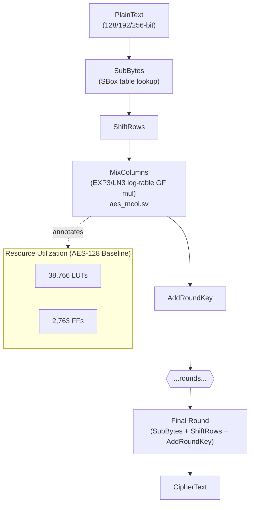
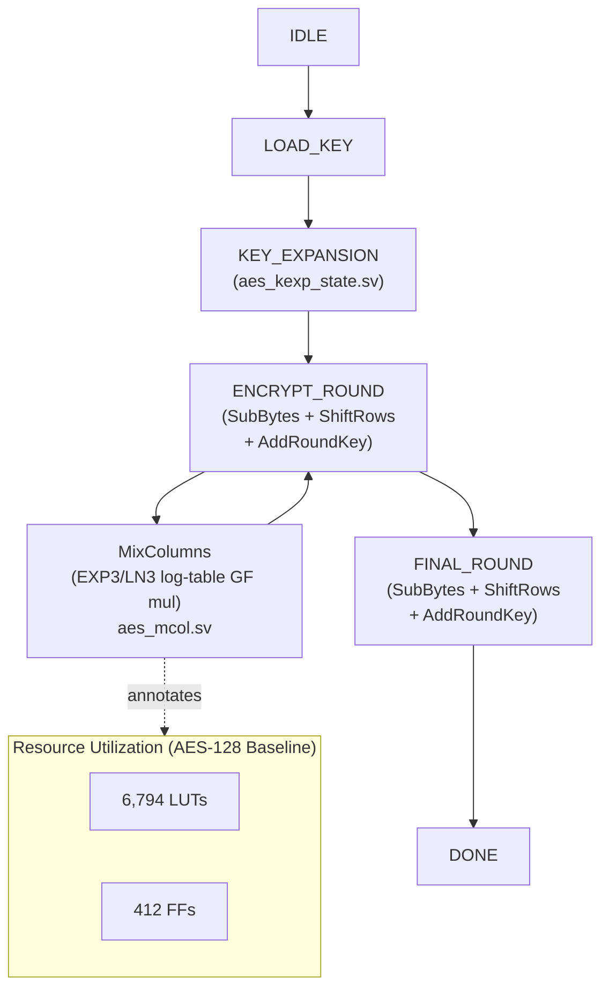
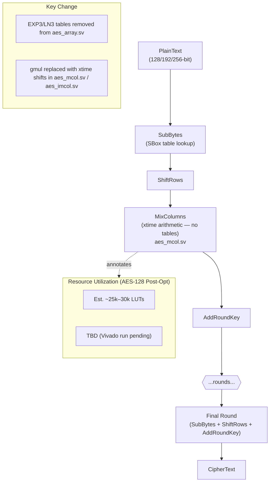
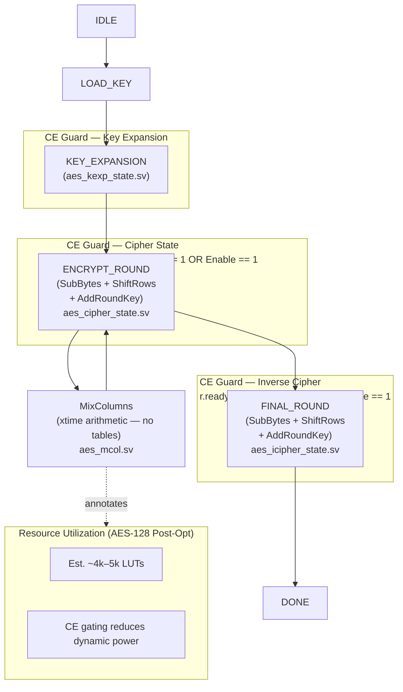

# AES RTL Architecture Flow: Baseline vs Modified

This document compares the baseline AES hardware architecture — which used EXP3/LN3 log-table GF multiplication — against the modified architecture that replaces log-table lookups with xtime arithmetic. The most significant resource change is the removal of the 512-entry EXP3 and LN3 lookup tables from `aes_array.sv`, which were consumed entirely by the MixColumns datapath. Clock enable (CE) gating was also added to the FSM state registers (`aes_cipher_state.sv`, `aes_icipher_state.sv`, `aes_kexp_state.sv`) to reduce dynamic switching power when the FSM is idle. Both the full-pipeline and FSM variants are covered below.

---

## Baseline Architecture

### Pipeline (Baseline)

### FSM (Baseline)

---

## Modified Architecture

### Pipeline (Modified)

### FSM (Modified)

---

## What Changed

| Module | Change | LUT Impact |
|--------|--------|------------|
| `aes_mcol.sv` / `aes_imcol.sv` | `gmul` replaced with xtime shifts | Major reduction (~30–35% pipeline, ~25–30% FSM) |
| `aes_array.sv` | `EXP3[256]` and `LN3[256]` tables removed (512 entries × 8-bit) | Eliminated table LUTs |
| `aes_cipher_state.sv` | CE guard (`r.ready==1` as third condition) on state register | Reduced dynamic switching power |
| `aes_icipher_state.sv` | CE guard on inverse cipher state register | Reduced dynamic switching power |
| `aes_kexp_state.sv` | CE guard (`r.state!=0 \|\| Enable`) — no ready bit | Reduced dynamic switching power |

---

## Synthesis Numbers

| Variant | Key Bits | Baseline LUTs | Baseline FFs | Post-Opt LUTs (est.) | Post-Opt FFs (est.) |
|---------|----------|---------------|--------------|----------------------|---------------------|
| Pipeline | 128 | 38,766 | 2,763 | ~25k–30k | TBD (Vivado run pending) |
| Pipeline | 192 | — | — | TBD (Vivado run pending) | TBD (Vivado run pending) |
| Pipeline | 256 | — | — | TBD (Vivado run pending) | TBD (Vivado run pending) |
| FSM | 128 | 6,794 | 412 | ~4k–5k | TBD (Vivado run pending) |
| FSM | 192 | — | — | TBD (Vivado run pending) | TBD (Vivado run pending) |
| FSM | 256 | — | — | TBD (Vivado run pending) | TBD (Vivado run pending) |

> **Note:** The authoritative after-run numbers (once Vivado synthesis is executed) are tracked in `.planning/phases/02-fsm-clock-enable-gating/SYNTH-COMPARISON.md`. Pipeline baseline rows are empty because the baseline was not captured before Phase 1 RTL edits — a known gap noted in STATE.md. Post-opt estimates are derived from the xtime arithmetic removal of the EXP3/LN3 tables and are subject to revision after Vivado output is available.
