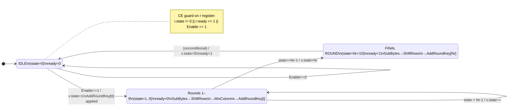
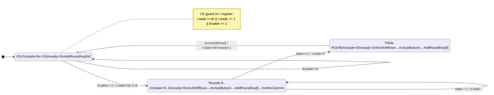
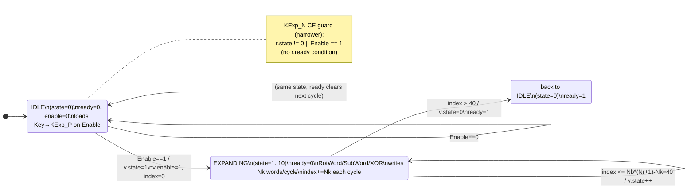

# AES FSM State Diagrams

Generated from: `rtl/aes_cipher_state.sv`, `rtl/aes_icipher_state.sv`, `rtl/aes_kexp_state.sv`
Parameters: Nr=10, Nb=4, Nk=4 (AES-128)

---

## 1. Encrypt FSM (aes_cipher_state)

The encrypt FSM counts upward from state 0 (IDLE) through 10 rounds, applying SubBytes, ShiftRows, MixColumns, and AddRoundKey per cycle, then signals completion at state Nr=10. On the IDLE self-loop, the datapath is fed with `Data_in` directly (initial AddRoundKey only); the register is clock-enabled to prevent spurious updates while idle.

> **CE guard (Phase 2):** The `r` register (packed `{state, ready}`) is gated:
> `r <= rin` only when `r.state != 0 || r.ready == 1 || Enable == 1`.
> The `r.ready == 1` third condition ensures the register advances one extra cycle
> to clear `ready` back to 0 after the final round completes.

---

## 2. Decrypt FSM (aes_icipher_state)

The decrypt FSM counts downward from state Nr=10 (IDLE) to state 0 (FINAL_ROUND), applying InvShiftRows, InvSubBytes, AddRoundKey, and InvMixColumns per cycle, then signals completion at state 0. The IDLE state applies AddRoundKey[Nr] only (no inverse operations) when `Enable` is first asserted.

> **CE guard (Phase 2):** The `r` register (packed `{state, ready}`) is gated:
> `r <= rin` only when `r.state != Nr || r.ready == 1 || Enable == 1`.
> Mirrors the encrypt FSM pattern — `r.ready == 1` allows the ready-clear cycle.

---

## 3. Key Expansion FSM (aes_kexp_state)

The key expansion FSM starts at state 0 (IDLE), loads the 128-bit key into `KExp_P` on the first enabled cycle, then iterates through states 1–10 writing Nk=4 expanded key words per cycle into `KExp_R` until index exceeds `Nb*(Nr+1)-Nk = 40`, at which point it returns to IDLE with `ready=1`. The `KExp_N` pipeline register has a separate, narrower CE guard compared to the main `r` register.

> **CE guard (Phase 2) — two separate guards:**
>
> - `KExp_N` pipeline register: `KExp_N <= KExp_P` only when `r.state != 0 || Enable == 1`.
>   No `r.ready` condition because `KExp_N` does not carry a ready bit and no extra propagation cycle is needed.
>
> - `r` control register: `r <= rin` only when `r.state != 0 || r.ready == 1 || Enable == 1`.
>   The `r.ready == 1` condition is present (same as cipher FSMs) for the ready-clear cycle.

---

## CE Guard Summary

| Module             | r Register CE Condition                            | Phase 2 Change                                  |
|--------------------|----------------------------------------------------|-------------------------------------------------|
| `aes_cipher_state`  | `r.state != 0  \|\| r.ready == 1 \|\| Enable == 1` | Added `r.ready == 1` third condition            |
| `aes_icipher_state` | `r.state != Nr \|\| r.ready == 1 \|\| Enable == 1` | Added `r.ready == 1` third condition            |
| `aes_kexp_state`    | `r.state != 0  \|\| r.ready == 1 \|\| Enable == 1` | Same pattern; KExp_N has narrower guard (below) |

| Module           | KExp_N CE Condition            | Rationale                                        |
|------------------|--------------------------------|--------------------------------------------------|
| `aes_kexp_state` | `r.state != 0 \|\| Enable == 1` | No ready bit on KExp_N; no ready-clear cycle needed |

**Key insight from Phase 2:** `r` is a packed struct containing both `state` and `ready`. Without the `r.ready == 1` guard condition, freezing the register in IDLE would also freeze `r.ready = 1`, preventing the output from ever clearing after the first use. The `r.ready == 1` condition lets the FSM take exactly one more clock edge to write `rin.ready = 0` back into `r`.
